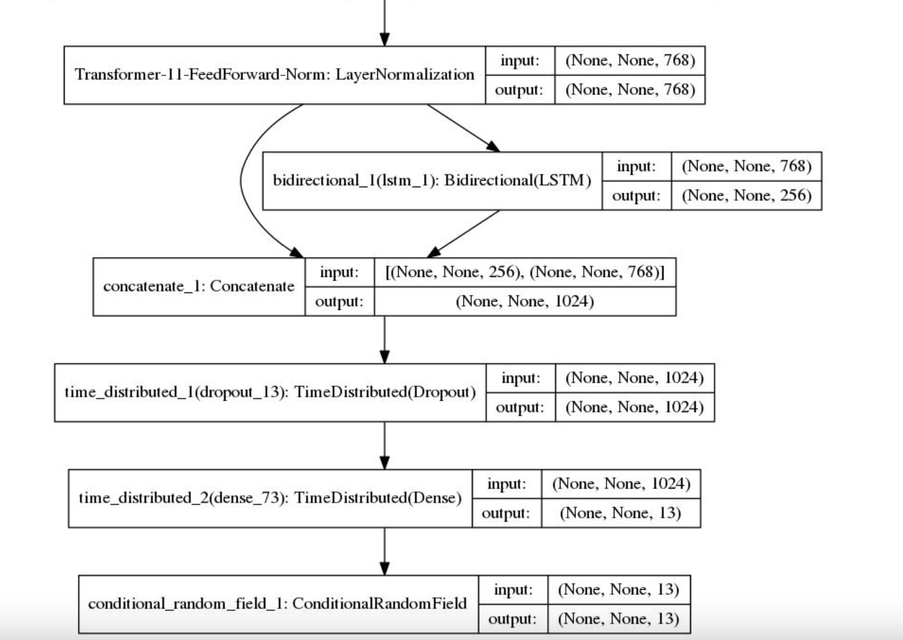
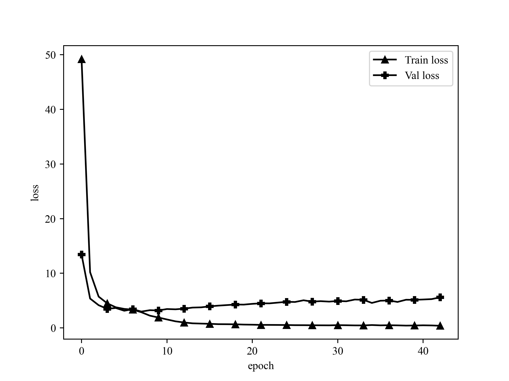
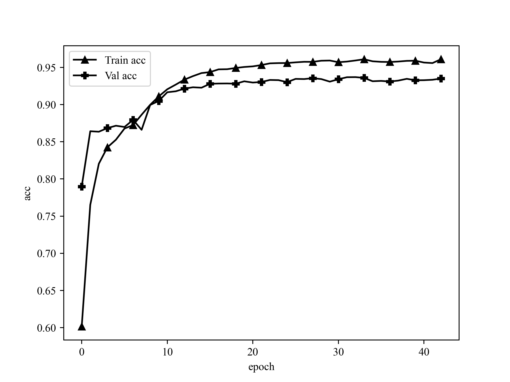
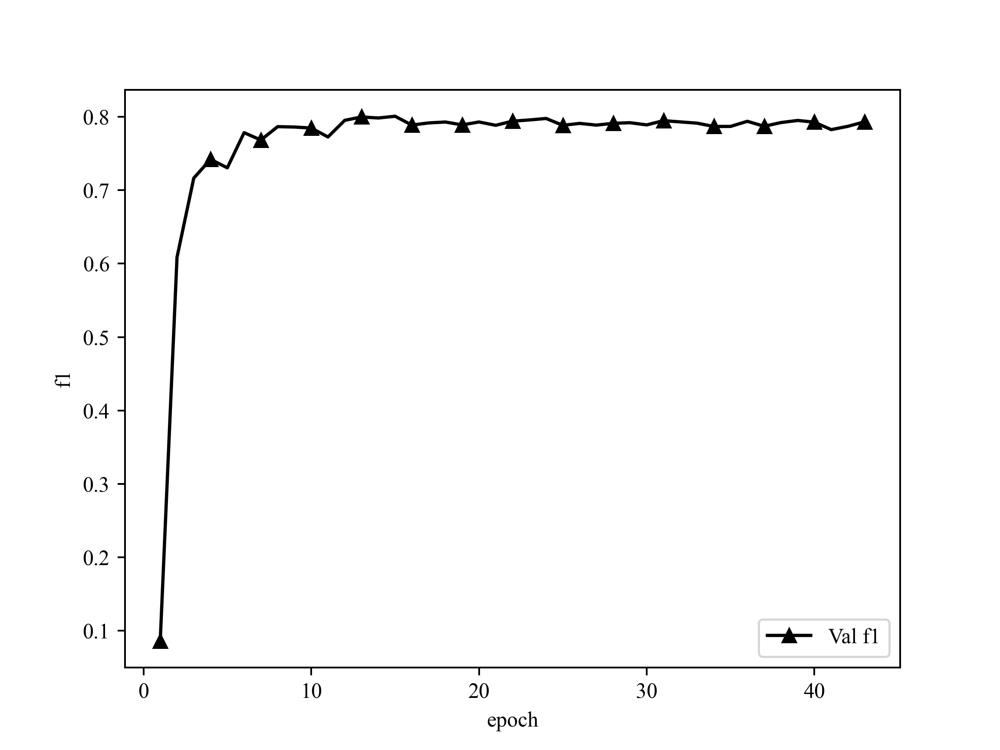

# CCKS2019医渡云4k电子病历数据集命名实体识别

## Dataset

Yidu-S4K数据集，对于给定的一组电子病历纯文本文档，任务的目标是识别并抽取出与医学临床相关的实体提及（entity mention），并将它们归类到预定义类别（pre-defined
categories），比如疾病、治疗、检查检验等。

1. 疾病和诊断：医学上定义的疾病和医生在临床工作中对病因、病生理、分型分期等所作的判断。
2. 检查： 影像检查（X线、CT、MR、PETCT等）+造影+超声+心电图，未避免检查操作与手术操作过多冲突，不包含此外其它的诊断性操作，如胃镜、肠镜等。
3. 检验： 在实验室进行的物理或化学检查，本期特指临床工作中检验科进行的化验，不含免疫组化等广义实验室检查
4. 手术： 医生在患者身体局部进行的切除、缝合等治疗，是外科的主要治疗方法。
5. 药物： 用于疾病治疗的具体化学物质。
6. 解剖部位： 指疾病、症状和体征发生的人体解剖学部位。

任务一数据结构： 任务一数据每一行为一个json json key 为`['originalText','entities']` 即原文和实体列表 `json["entities"]`
为列表，每个元素代表一个实体entity，其中有该实体在原文中的起始位置`start_pos`,结束位置`end_pos`,以及实体类型

训练样本1000条，提交的测试样本379条，经过处理后转成BIO格式，形如：

```
心	B-TESTIMAGE
脏	I-TESTIMAGE
彩	I-TESTIMAGE
超	I-TESTIMAGE
：	O
右	B-ANATOMY
房	I-ANATOMY
、	O
右	B-ANATOMY
室	I-ANATOMY
稍	O
增	O
大	O
，	O
E	B-TESTLAB
F	I-TESTLAB
正	O
常	O
。	O
```

ATTENTION:

- 字与标签之间用tab（"\t"）隔开
- 其中句子与句子之间使用空行隔开
- 文件最后以两个换行结束

句长与数量信息可以运行`statistic.py`以查看

## Project Structure

```
./
├── README.md
├── __pycache__
├── chinese_roformer-v2-char_L-12_H-768_A-12    roformer_v2 base权重文件
│   ├── bert_config.json
│   ├── bert_model.ckpt.data-00000-of-00001
│   ├── bert_model.ckpt.index
│   ├── bert_model.ckpt.meta
│   ├── checkpoint
│   └── vocab.txt
├── chinese_roformer-v2-char_L-6_H-384_A-6      roformer_v2 small 权重文件
│   ├── bert_config.json
│   ├── bert_model.ckpt.data-00000-of-00001
│   ├── bert_model.ckpt.index
│   ├── bert_model.ckpt.meta
│   ├── checkpoint
│   └── vocab.txt
├── config.py                                   模型可能需要调整的超参数
├── data                                        数据集文件夹
│   ├── yidu.test                               官方提供的379个测试样本
│   ├── yidu.train                              从划分官方1000个训练样本中划分的的训练集
│   ├── yidu.validate                           从划分官方1000个训练样本中划分的的验证集
│   └── yidu_catagory.pkl                       类别set，由train.py生成，predict.py中用到
├── evaluate.py
├── images                                      训练、评估数据生成的图片
│   ├── train_acc.png
│   ├── train_loss.png
│   └── val_f1.png
├── log                                         训练日志，由train.py生成
│   ├── train_loss.csv
│   ├── val_f1.csv
│   ├── yidu.out
│   └── yidu_f1.out
├── model.py                                    构建模型
├── path.py                                     所有路径
├── predict.py                                  模型预测输出
├── preprocess.py                               数据预处理
├── statistic.py                                统计句长与数量信息，以便调整和设置maxlen
├── report                                      评估报告，由evaluate.py生成
│   └── yidu_bert_base.csv                      每个类别的精准、召回、F1
├── train.py                                    训练文件
├── requirements.txt                            pip环境
├── plot.py                                     画图工具
├── utils                                       bert4keras工具包，也可pip下载
│   ├── __init__.py
│   ├── __pycache__
│   ├── backend.py
│   ├── layers.py
│   ├── models.py
│   ├── optimizers.py
│   ├── snippets.py
│   └── tokenizers.py
└── weights                                     保存的权重
    ├── yidu_catagory.pkl                       实体类别
    ├── yidu_roformer_v2_base.h5                模型权重
    └── yidu_roformer_v2_crf_trans.pkl          最佳模型的权重
```

## Requirements

```
Keras==2.2.4
matplotlib==3.4.0
pandas==1.2.3
tensorflow==1.14.0
tqdm==4.61.2
```

## Steps

1. 替换数据集
2. 修改path.py中的地址
3. 删掉旧的weights/{}_catagory.pkl类别set文件
4. 根据需要修改model.py模型结构
5. 修改config.py的参数
6. Debug
7. 训练

## Model

### 上游

[GitHub - ZhuiyiTechnology/roformer-v2: RoFormer升级版](https://github.com/ZhuiyiTechnology/roformer-v2)
是RoFormer升级版，主要通过结构的简化来提升速度，并通过无监督预训练和有监督预训练的结合来提升效果，从而达到了速度与效果的“双赢”。相比RoFormer，RoFormerV2的主要改动是简化模型结构、增加训练数据以及加入有监督训练，这些改动能让RoFormerV2最终取得了速度和效果的“双赢”。

- **Small版**
  ： [chinese_roformer-v2-char_L-6_H-384_A-6.zip](https://open.zhuiyi.ai/releases/nlp/models/zhuiyi/chinese_roformer-v2-char_L-6_H-384_A-6.zip)
- **Base版**
  ： [chinese_roformer-v2-char_L-12_H-768_A-12.zip](https://open.zhuiyi.ai/releases/nlp/models/zhuiyi/chinese_roformer-v2-char_L-12_H-768_A-12.zip)
- **Large版**
  ： [chinese_roformer-v2-char_L-24_H-1024_A-16.zip](https://open.zhuiyi.ai/releases/nlp/models/zhuiyi/chinese_roformer-v2-char_L-24_H-1024_A-16.zip)

### 下游



模型大小

> * **Small版**：两张3090（24G），先用无监督MLM训练了100万步（maxlen为512），然后有监督多任务训练了75万步（maxlen从64到512不等，取决于任务），batch_size为512，优化器为LAMB；
> * **Base版**：四张3090（24G），先用无监督MLM训练了100万步（maxlen为512），然后有监督多任务训练了75万步（maxlen从64到512不等，取决于任务），batch_size为512，优化器为LAMB；
> * **Large版**：两张A100（80G），先用无监督MLM训练了100万步（maxlen为512），然后有监督多任务训练了50万步（maxlen从64到512不等，取决于任务），batch_size为512，优化器为LAMB。

## Config

- `maxlen` 训练中每个batch的最大单句长度，少于填充，多于截断
- `epochs` 最大训练轮次
- `batch_size` batch size
- `bert_layers` bert层数，small ≤ 4,base ≤ 12
- `crf_lr_multiplier` CRF层放大的学习率，必要时扩大它
- `model_type` 模型， 'roformer_v2'
- `dropout_rate` dropout比率
- `max_lr` 最大学习率，bert_layers越大应该越小，small建议5e-5~1e-4，base建议1e-5~5e-5
- `lstm_hidden_units` lstm隐藏层数量

ATTENTION: 并非所有句子都要填充到同一个长度，要求每个batch内的每个样本长度一致即可。所以若batch中最大长度 ≤ maxlen，则该batch将填充or截断到最长句子长度，若batch中最大长度 ≥
maxlen，则该batch将填充or截断到config.py中的maxlen

## Train

### 策略

#### 划分策略

将1000条训练样本按8：2划分成训练集、验证集，并shuffle。

#### 优化策略

- 使用EMA(exponential mobing average)滑动平均配合Adam作为优化策略。滑动平均可以用来估计变量的局部值，是的变量的更新与一段时间内的历史值有关。它的意义在于利用滑动平均的参数来提高模型在测试数据上的健壮性。
  EMA 对每一个待更新训练学习的变量 (variable) 都会维护一个影子变量 (shadow variable)。影子变量的初始值就是这个变量的初始值。
- BERT模型由于已经有了预训练权重，所以微调权重只需要很小的学习率，而LSTM和Dense使用的`he_normal`
  初始化学习率，需要使用较大学习率，所以本模型使用[分层学习率](https://kexue.fm/archives/6418)
- 在Embedding层注入扰动，[对抗训练](https://kexue.fm/archives/7234) ，使模型更具鲁棒性。

#### 停止策略

在callback中计算验证集实体F1值，监控它。5轮不升即停。

### 日志

```
Epoch 1/999
78/78 [==============================] - 342s 4s/step - loss: 44.7248 - sparse_accuracy: 0.8038
valid:  f1: 0.05063, precision: 0.06611, recall: 0.04103, best f1: 0.05063
Epoch 2/999
78/78 [==============================] - 313s 4s/step - loss: 13.2246 - sparse_accuracy: 0.9135
valid:  f1: 0.67956, precision: 0.70216, recall: 0.65837, best f1: 0.67956
Epoch 3/999
78/78 [==============================] - 319s 4s/step - loss: 5.9724 - sparse_accuracy: 0.9418
valid:  f1: 0.81794, precision: 0.83338, recall: 0.80306, best f1: 0.81794

...

Epoch 16/999
78/78 [==============================] - 308s 4s/step - loss: 1.6843 - sparse_accuracy: 0.9109
Early stop count 3/5
valid:  f1: 0.87578, precision: 0.86848, recall: 0.88321, best f1: 0.87753
Epoch 17/999
78/78 [==============================] - 323s 4s/step - loss: 1.5966 - sparse_accuracy: 0.9090
Early stop count 4/5
valid:  f1: 0.87717, precision: 0.86962, recall: 0.88485, best f1: 0.87753
Epoch 18/999
78/78 [==============================] - 324s 4s/step - loss: 1.4774 - sparse_accuracy: 0.9092
Early stop count 5/5
Epoch 00018: early stopping THR
valid:  f1: 0.87693, precision: 0.86916, recall: 0.88485, best f1: 0.87753
```

验证集crf loss



训练集crf acc:



### Evaluate

### 策略

评估策略为实体级别的F1，抽取到的每个实体的label、在每句中的起始坐标、终止坐标都正确才算对

可以评估：

- 总的F1：所有类别一起统计，TP为所有label、起始坐标、终止坐标都正确的个数，TP+FP为预测实体总数，TP+FN为真实实体总数
- 每类的F1：分类统计，TP为每个列别的起始坐标、终止坐标都正确的个数，TP+FP为每个类别的预测实体总数，TP+FN为每个类别的真实实体总数

### 评估单个模型

```python
evaluate_one(save_file_path = weights_path + '/yidu_roformer_v2_base.h5',
             dataset_path = "./data/yidu.test",
             csv_path = './report/yidu_bert_base.csv',
             evaluate_categories_f1 = True)
```

`save_file_path`，`dataset_path`是评估数据集路径，`evaluate_categories_f1`为是否评估每个类别的F1（时间会比评估总的F1长很多），`csv_path`
是每类F1数据生成的csv文件存放路径。

ATTENTION: 1个batch只进1条句子，所以可以无视train的maxlen，但是tokenize后长于512的部分将无法被预测，也不会被算进P里

## Performance

### 测试集表现



### 验证集最佳F1

```
Epoch 13/999
78/78 [==============================] - 314s 4s/step - loss: 1.9135 - sparse_accuracy: 0.9114
valid:  f1: 0.87753, precision: 0.87033, recall: 0.88485, best f1: 0.87753
```

### 官方提供的379条测试样本表现

```
weight path:/home/bureaux/Projects/NamedEntityRecognization/weights/yidu_roformer_v2_base.h5
evaluate dataset path:./data/yidu.test
Evaluating General F1: 100%|████████████████████████████████████| 2035/2035 [03:11<00:00, 10.60it/s]
General:  f1: 0.87700, precision: 0.86014, recall: 0.89454
```

### 官方提供的379条测试样本表现每的类别F1评测结果

```
Evaluating F1 of each Categories: 100%|█████████████████████████| 2035/2035 [19:37<00:00,  1.73it/s]
             TP  TP+FP  TP+FN  precision  recall      f1
ANATOMY    2788   3286   3094     0.8484  0.9011  0.8740
DISEASE    1176   1332   1323     0.8829  0.8889  0.8859
DRUG        470    497    485     0.9457  0.9691  0.9572
OPERATION   143    158    162     0.9051  0.8827  0.8938
TESTIMAGE   326    366    348     0.8907  0.9368  0.9132
TESTLAB     466    603    590     0.7728  0.7898  0.7812
```

## Predict

```python
txt = '1997-8-6行胃癌根治术，2010.11发现CA724 升高最高1295 ，复查PET-CT检查未见复发转移，之后多次复查CA724 波动在500-800之间，多次查胃镜提示吻合口炎，给予对症治疗，患者感左下腹隐痛下腹隐痛不适，2013.10.15复查血CA724 147 CA199 13.62 ,2013.10.23复查腹部CT检查提示胰腺占位，考虑恶性，胰头周围，肝门，腹膜后多发多发淋巴结转移。PET-CT提示：胰头区高代谢，考虑恶性病变。患者近10天出现午饭后左下腹部胀痛，持续2-3小时候可自行缓解。体重近1月上降2KG.患者胰腺穿刺取病理示低分化腺癌，免疫组化示CEA+,CGA+/-,CD56+/-,SYN+/-,对手术有顾虑，且手术风险较大，2013-11-26行放疗30次，2014-1-7放疗结束。2013-11-28始行单药吉西他滨化疗4周期。末次2014-1-7.放化疗中出现黄疸，对症治疗后好转。化疗后患者出现II度白细胞降低、II度血小板降低。2014-1-24复查胰头区病灶及腹腔淋巴结均较强缩小，胰腺穿刺病理中低分化腺癌，免疫组化CA19+,CK7+,CGA-,SYN-,CD56-,CA199+，符合胆、胰导管来源浸润性腺癌。CA72.4 明显上降。2014-1-27病理比对原胃切除标本报告与胰腺肿瘤存在较大形态差异。考虑患者明确胰腺癌，于2014-2-7行第5周期GEM化疗，2014-2复查后病灶缩小SD，于2014-2-21开始第六周期化疗，因第八天白细胞减少推迟到2014-3-3。2014-4-7第8周期化疗。末次给药2014-4-14.2014-4-21复查评效SD，略有缩小，CA72.4降低至11.12.2014-4-28继续单药GEM化疗，末次给药时间2014-9-1.GEM双周一次，2014-7-24复查胰腺病灶继续缩小,评效PR。现患者无明显不适，饮食、睡眠可，体重较前上降约4KG。'
for i in predict(txt = txt,
                 weights_path = weights_path + '/yidu_roformer_v2_base.h5',
                 label_dict_path = label_dict_path,
                 trans_path = "./weights/yidu_roformer_v2_crf_trans.pkl"):
    print(i)
```

txt为输入文本，save_file_path为使用权重的路径，label_dict_path为实体类别字典的pkl文件，trans_path为模型转移矩阵文件。缺一不可。

输出结果

```
[
    ('胃癌根治术', 'OPERATION', 9, 13)
    ('CA724', 'TESTLAB', 24, 28)
    ('PET-CT', 'TESTIMAGE', 42, 47)
    ('CA724', 'TESTLAB', 63, 67)
    ('吻合口炎', 'DISEASE', 89, 92)
    ('左下腹', 'ANATOMY', 104, 106)
    ('下腹', 'ANATOMY', 109, 110)
    ('CA724', 'TESTLAB', 129, 133)
    ('腹部CT', 'TESTIMAGE', 164, 167)
    ('胰腺', 'ANATOMY', 172, 173)
    ('胰头', 'ANATOMY', 182, 183)
    ('肝门', 'ANATOMY', 187, 188)
    ('腹膜', 'ANATOMY', 190, 191)
    ('PET-CT', 'TESTIMAGE', 203, 208)
    ('胰头区', 'ANATOMY', 212, 214)
    ('左下腹部', 'ANATOMY', 237, 240)
    ('胰腺', 'ANATOMY', 271, 272)
    ('低分化腺癌', 'DISEASE', 279, 283)
    ('吉西他滨', 'DRUG', 376, 379)
    ('白细胞', 'TESTLAB', 424, 426)
    ('血小板', 'TESTLAB', 433, 435)
    ('胰头区', 'ANATOMY', 450, 452)
    ('腹腔淋巴结', 'ANATOMY', 456, 460)
    ('胰腺', 'ANATOMY', 467, 468)
    ('中低分化腺癌', 'DISEASE', 473, 478)
    ('胆', 'ANATOMY', 520, 520)
    ('胰', 'ANATOMY', 522, 522)
    ('CA72.4', 'TESTLAB', 533, 538)
    ('胃', 'ANATOMY', 559, 559)
    ('胰腺肿瘤', 'DISEASE', 567, 570)
    ('胰腺癌', 'DISEASE', 586, 588)
]
```

输出格式为`(实体, 类别, 起始坐标, 终止坐标)`
