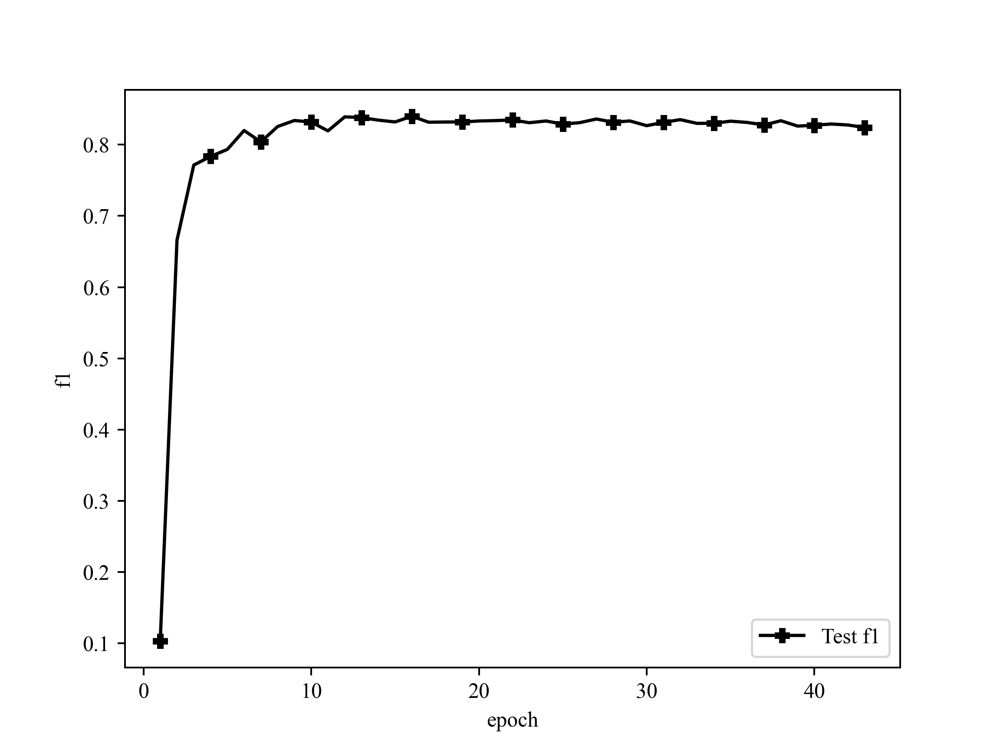

# ALBERT CCKS2019医渡云4k电子病历数据集命名实体识别

## Dataset

Yidu-S4K数据集，对于给定的一组电子病历纯文本文档，任务的目标是识别并抽取出与医学临床相关的实体提及（entity mention），并将它们归类到预定义类别（pre-defined
categories），比如疾病、治疗、检查检验等。

1. 疾病和诊断：医学上定义的疾病和医生在临床工作中对病因、病生理、分型分期等所作的判断。
2. 检查： 影像检查（X线、CT、MR、PETCT等）+造影+超声+心电图，未避免检查操作与手术操作过多冲突，不包含此外其它的诊断性操作，如胃镜、肠镜等。
3. 检验： 在实验室进行的物理或化学检查，本期特指临床工作中检验科进行的化验，不含免疫组化等广义实验室检查
4. 手术： 医生在患者身体局部进行的切除、缝合等治疗，是外科的主要治疗方法。
5. 药物： 用于疾病治疗的具体化学物质。
6. 解剖部位： 指疾病、症状和体征发生的人体解剖学部位。

任务一数据结构： 任务一数据每一行为一个json json key 为`['originalText','entities']` 即原文和实体列表 `json["entities"]`
为列表，每个元素代表一个实体entity，其中有该实体在原文中的起始位置`start_pos`,结束位置`end_pos`,以及实体类型

训练样本1000条，提交的测试样本379条，经过处理后转成BIO格式，形如：

```
心	B-TESTIMAGE
脏	I-TESTIMAGE
彩	I-TESTIMAGE
超	I-TESTIMAGE
：	O
右	B-ANATOMY
房	I-ANATOMY
、	O
右	B-ANATOMY
室	I-ANATOMY
稍	O
增	O
大	O
，	O
E	B-TESTLAB
F	I-TESTLAB
正	O
常	O
。	O
```

ATTENTION:

- 字与标签之间用tab（"\t"）隔开
- 其中句子与句子之间使用空行隔开
- 文件最后以两个换行结束

句长与数量信息可以运行`statistic.py`以查看

## Project Structure

```
./
├── README.md
├── __pycache__
├── albert_tiny_google_zh                       albert tiny 权重文件
│   ├── albert_config.json
│   ├── albert_model.ckpt.data-00000-of-00001
│   ├── albert_model.ckpt.index
│   ├── checkpoint
│   └── vocab.txt                               词表
├── config.py                                   模型可能需要调整的超参数
├── data                                        数据集文件夹
│   ├── yidu.submit                             官方提供的379个测试样本
│   ├── yidu.test                               从划分官方1000个训练样本中划分的的测试集
│   ├── yidu.train                              从划分官方1000个训练样本中划分的的训练集
│   ├── yidu.validate                           从划分官方1000个训练样本中划分的的验证集
│   └── yidu_catagory.pkl                       类别set，由train.py生成，predict.py中用到
├── evaluate.py
├── images                                      训练、评估数据生成的图片
│   ├── test_f1.png
│   ├── train_acc.png
│   ├── train_loss.png
│   └── val_f1.png
├── log                                         训练日志，由train.py生成
│   ├── nohup_train.out
│   └── train_log.csv
├── model.py                                    构建模型
├── path.py                                     所有路径
├── predict.py                                  模型预测输出
├── preprocess.py                               数据预处理
├── statistic.py                                统计句长与数量信息，以便调整和设置maxlen
├── report                                      评估报告，由evaluate.py生成
│   ├── f1.csv                                  每轮保存模型的总体F1
│   ├── final_test_set.out
│   └── nohup_evaluate.out
├── train.py                                    训练文件
├── requirements.txt                            pip环境
├── utils                                       bert4keras工具包，也可pip下载
│   ├── __init__.py
│   ├── __pycache__
│   ├── backend.py
│   ├── layers.py
│   ├── models.py
│   ├── optimizers.py
│   ├── plot.py                                 画图工具
│   ├── snippets.py
│   └── tokenizers.py
└── weights                                     保存的权重
    ├── yidu_albert_tiny_ep15.h5
    └── yidu_albert_tiny_ep16.h5
```

## Requirements

```
Keras==2.2.4
matplotlib==3.4.0
pandas==1.2.3
tensorflow==1.14.0
tqdm==4.61.2
```

## Steps

1. 替换数据集
2. 修改path.py中的地址
3. 删掉旧的data/{}_catagory.pkl类别set文件
4. 根据需要修改model.py模型结构
5. 修改config.py的参数
6. 训练

## Model

ALBERT权重使用经过转换brightmart版的albert权重。[下载连接](https://github.com/bojone/albert_zh)

可以根据需要换成albert base、albert large、albert xlarge。

转换出来的模型，Embedding层都是没有低秩分解的，但是保留了transformer block的跨层参数共享。

> ALBert is based on Bert, but with some improvements. It achieves state of the art performance on main benchmarks with 30% parameters less.
> For albert_base_zh it only has ten percentage parameters compare of original bert model, and main accuracy is retained.
>
> Different version of ALBERT pre-trained model for Chinese, including TensorFlow, PyTorch and Keras, is available now.
>
> 海量中文语料上预训练ALBERT模型：参数更少，效果更好。预训练小模型也能拿下13项NLP任务，ALBERT三大改造登顶GLUE基准
>
> 一键运行10个数据集、9个基线模型、不同任务上模型效果的详细对比，见中文语言理解基准测评 CLUE benchmark

模型大小

> albert_tiny_zh, albert_tiny_zh(训练更久，累积学习20亿个样本)，文件大小16M、参数为4M
>
> albert_tiny使用同样的大规模中文语料数据，层数仅为4层、hidden size等向量维度大幅减少; 尝试使用如下学习率来获得更好效果：{2e-5, 6e-5, 1e-4}
>
> albert_tiny_google_zh(累积学习10亿个样本,google版本)，模型大小16M、性能与albert_tiny_zh一致
>
> albert_small_google_zh(累积学习10亿个样本,google版本)， 速度比bert_base快4倍；LCQMC测试集上比Bert下降仅0.9个点；去掉adam后模型大小18.5M
>
> albert_large_zh,参数量，层数24，文件大小为64M
>
> albert_base_zh(额外训练了1.5亿个实例即 36k steps * batch_size 4096); albert_base_zh(小模型体验版), 参数量12M, 层数12，大小为40M
>
> 参数量为bert_base的十分之一，模型大小也十分之一；在口语化描述相似性数据集LCQMC的测试集上相比bert_base下降约0.6~1个点；相比未预训练，albert_base提升14个点
>
> albert_xlarge_zh_177k ; albert_xlarge_zh_183k(优先尝试)参数量，层数24，文件大小为230M
>
> 参数量和模型大小为bert_base的二分之一；需要一张大的显卡；完整测试对比将后续添加；batch_size不能太小，否则可能影响精度

## Config

- `maxlen` 训练中每个batch的最大单句长度，少于填充，多于截断
- `epochs` 最大训练轮次
- `batch_size` batch size
- `bert_layers` bert层数，albert ≤ 4
- `crf_lr_multiplier` CRF层放大的学习率，必要时扩大它
- `model_type` 模型， 'albert'
- `dropout_rate` dropout比率
- `max_lr` warmup最大的学习率，bert_layers越大应该越小
- `lstm_hidden_units` lstm隐藏层数量

ATTENTION: 并非所有句子都要填充到同一个长度，要求每个batch内的每个样本长度一致即可。所以若batch中最大长度 ≤ maxlen，则该batch将填充or截断到最长句子长度，若batch中最大长度 ≥ maxlen，则该batch将填充or截断到config.py中的maxlen

## Train

### 策略

将1000条训练样本按8：1：1划分成训练集、验证集、测试集，并shuffle。

使用warmup调整学习率，0～1000步时，学习率从0线性增加到1e-3，然后1000～2000步时，学习率从1e-3线性下降到1e-4，2000步后学习率保持1e-4不变。

监控crf val acc，因为发现crf val loss不再下降时验证集F1以及测试集F1任然可能变好。10轮不升即停，并保存每轮权重以便后续评估。

### 日志

```
Epoch 1/100
 - 770s - loss: 49.1390 - sparse_accuracy: 0.6018 - val_loss: 13.4391 - val_sparse_accuracy: 0.7898
Epoch 2/100
 - 753s - loss: 10.2020 - sparse_accuracy: 0.7653 - val_loss: 5.3708 - val_sparse_accuracy: 0.8641
Epoch 3/100
 - 733s - loss: 5.7223 - sparse_accuracy: 0.8205 - val_loss: 4.1568 - val_sparse_accuracy: 0.8634

...

Epoch 41/100
 - 715s - loss: 0.4751 - sparse_accuracy: 0.9565 - val_loss: 5.1990 - val_sparse_accuracy: 0.9327
Epoch 42/100
 - 705s - loss: 0.4503 - sparse_accuracy: 0.9558 - val_loss: 5.2695 - val_sparse_accuracy: 0.9333
Epoch 43/100
 - 728s - loss: 0.3920 - sparse_accuracy: 0.9609 - val_loss: 5.6035 - val_sparse_accuracy: 0.9349
Epoch 00043: early stopping
```

验证集crf loss


训练集crf acc:


### Evaluate

### 策略

评估策略为实体级别的F1，抽取到的每个实体的label、在每句中的起始坐标、终止坐标都正确才算对

可以评估：

- 总的F1：所有类别一起统计，TP为所有label、起始坐标、终止坐标都正确的个数，TP+FP为预测实体总数，TP+FN为真实实体总数 
- 每类的F1：分类统计，TP为每个列别的起始坐标、终止坐标都正确的个数，TP+FP为每个类别的预测实体总数，TP+FN为每个类别的真实实体总数

### 评估所有保存的模型

保存下来的每轮模型都计算Precision、Recall、F1。

```python
evaluate_all(weights_path)
```

将自动读取weights_path文件夹下所有模型进行评估，对验证集、测试集进行评估

```
/Volumes/Riesling/TRAIN/AI-base/src/albert_tiny/weights/yidu_albert_tiny_ep01.h5:
validate:  f1: 0.08551, precision: 0.22426, recall: 0.05283
test:  f1: 0.10280, precision: 0.27338, recall: 0.06330

/Volumes/Riesling/TRAIN/AI-base/src/albert_tiny/weights/yidu_albert_tiny_ep02.h5:
validate:  f1: 0.60864, precision: 0.68067, recall: 0.55040
test:  f1: 0.66606, precision: 0.73801, recall: 0.60689

...

/Volumes/Riesling/TRAIN/AI-base/src/albert_tiny/weights/yidu_albert_tiny_ep42.h5:
validate:  f1: 0.78719, precision: 0.78571, recall: 0.78868
test:  f1: 0.82762, precision: 0.83017, recall: 0.82510

/Volumes/Riesling/TRAIN/AI-base/src/albert_tiny/weights/yidu_albert_tiny_ep43.h5:
validate:  f1: 0.79335, precision: 0.78891, recall: 0.79784
test:  f1: 0.82405, precision: 0.82246, recall: 0.82565
```

### 评估单个模型

```python
evaluate_one(save_file_path = weights_path + '/yidu_albert_tiny_ep15.h5',
             dataset_path = "./data/yidu.submit",
             csv_path = './report/yidu_albert_tiny_ep15.csv',
             evaluate_categories_f1 = True)
```

`save_file_path`，`dataset_path`是评估数据集路径，`evaluate_categories_f1`为是否评估每个类别的F1（时间会比评估总的F1长很多），`csv_path`是每类F1数据生成的csv文件存放路径。

每的类别F1评测结果：

```
             TP  TP+FP  TP+FN  precision  recall      f1
ANATOMY    2634   3222   3094     0.8175  0.8513  0.8341
DISEASE    1022   1310   1323     0.7802  0.7725  0.7763
DRUG        395    450    485     0.8778  0.8144  0.8449
OPERATION   129    154    162     0.8377  0.7963  0.8165
TESTIMAGE   293    342    348     0.8567  0.8420  0.8493
TESTLAB     373    509    590     0.7328  0.6322  0.6788
```

ATTENTION: 1个batch只进1条句子，所以可以无视train的maxlen，但是tokenize后长于`albert_tiny_google_zh/albert_config.json`中的`max_position_embeddings`的部分将无法被预测，也不会被算进P里

## Performance

### 验证集表现


### 测试集表现



### 验证集最佳F1

```
100%|█████████████████████████████████████████████████████████████| 653/653 [00:19<00:00, 33.02it/s]
validate:  f1: 0.80086, precision: 0.79850, recall: 0.80323
```

### 划分的测试集最佳F1

```
100%|█████████████████████████████████████████████████████████████| 620/620 [00:15<00:00, 39.54it/s]
test:  f1: 0.83990, precision: 0.84533, recall: 0.83454
```

### 官方提供的379条测试样本表现

```
100%|███████████████████████████████████████████████████████████| 2035/2035 [00:55<00:00, 36.50it/s]
finaltestset:  f1: 0.80841, precision: 0.80942, recall: 0.80740
```

## Predict

```python
# segment_ids后面长于512的部分将被截断，无法预测
txt = '，缘于入院前4月余于我院诊断为直肠癌，于2016-01-21在全麻上行腹腔镜上直肠癌姑息性切除术DIXON，，术后病理：（201602459）1、（直肠），：肠溃疡型管状腺癌II级，侵及外膜层。'
for i in predict(txt = txt,
                 save_file_path = weights_path + '/yidu_albert_tiny_ep15.h5'):
    print(i)
```

txt为输入文本，save_file_path为使用权重的路径

输出结果

```
[
    ('消化道穿孔可能', 'DISEASE', 3, 9), 
    ('胃', 'ANATOMY', 16, 16), 
    ('肠', 'ANATOMY', 17, 17)
    ('舒普深', 'DRUG', 36, 38), 
    ('奥硝唑', 'DRUG', 40, 42), 
    ('腹', 'ANATOMY', 58, 58)
]
```

输出格式为`(实体, 类别, 起始坐标, 终止坐标)`

ATTENTION: 1个batch只进1条句子，所以可以无视train的maxlen，但是tokenize后长于`albert_tiny_google_zh/albert_config.json`中的`max_position_embeddings`的部分将无法被预测